# NASA C-MAPSS RUL Prediction — Benchmark Documentation

*All metrics verified against `results/*.csv` and `docs/epoch_metrics_*.csv`.*

## Presentation Summary

This project benchmarks **13 completed models** (6 ML + 5 DL + 2 Graph) on NASA C-MAPSS FD001–FD004. Primary metric: **last-cycle RMSE** with RUL capped at 125. Best overall: **ExtraTrees** (FD001, RMSE 13.89), **Transformer** (FD002, RMSE 26.57), **HistGradientBoosting** (FD003, RMSE 17.13), **HistGradientBoosting** (FD004, RMSE 29.39). Top sensors for RUL: **sensor_11, sensor_4, sensor_12** (FD001).

## Dataset Explanation

| Dataset | Train Engines | Test Engines | Conditions | Fault Modes | Difficulty |

|---------|---------------|--------------|------------|-------------|------------|

| FD001 | 100 | 100 | 1 | 1 (HPC) | Easy |

| FD002 | 260 | 259 | 6 | 1 (HPC) | Medium |

| FD003 | 100 | 100 | 1 | 2 (HPC+Fan) | Medium |

| FD004 | 248 | 249 | 6 | 2 (HPC+Fan) | **Hard** |

## Why FD004 Is Harder Than FD001

1. Six operating conditions vs one.
2. Two fault modes vs one.
3. Best RMSE on FD004 (29.39) vs FD001 (13.89) — 2.1× higher error.
4. Larger fleet with more heterogeneity and sensor noise.

## Data Preparation & Preprocessing

1. Load train/test/RUL per FD subset.

2. Compute RUL; cap training RUL at **125**.

3. Drop constant sensors.

4. **ML**: raw + unit-relative + rolling mean/std (window=5).

5. **DL/Graph**: unit-relative + StandardScaler; 30-step sequences.

6. **Evaluation**: last cycle per test engine.

## Models Benchmarked

- **ML (6)**: Ridge, ElasticNet, RandomForest, ExtraTrees, HistGradientBoosting, XGBoost

- **DL (5)**: LSTM, GRU, CNN1D, TCN, Transformer

- **Graph (2)**: TemporalGCN, TemporalGAT

## Best Model Per Dataset (verified)

| Dataset | Model | Family | RMSE | MAE | R2 |
| --- | --- | --- | --- | --- | --- |
| FD001 | ExtraTrees | ML | 13.89 | 10.2 | 0.8883 |
| FD002 | Transformer | DL | 26.57 | 19.12 | 0.7525 |
| FD003 | HistGradientBoosting | ML | 17.13 | 12.85 | 0.8288 |
| FD004 | HistGradientBoosting | ML | 29.39 | 21.66 | 0.7095 |

## Epoch Metrics — ML (stages 10/50/100/200)

### FD001

| Model | 10 | 50 | 100 | 200 |
| --- | --- | --- | --- | --- |
| ExtraTrees | 14.47 | 13.83 | 14.04 | 13.98 |
| HistGradientBoosting | 26.61 | 14.05 | 14.12 | 14.31 |
| XGBoost | 28.42 | 14.57 | 14.35 | 14.41 |

### FD002

| Model | 10 | 50 | 100 | 200 |
| --- | --- | --- | --- | --- |
| ExtraTrees | 30.11 | 29.77 | 29.52 | 29.6 |
| HistGradientBoosting | 40.99 | 29.95 | 28.73 | 28.29 |
| XGBoost | 41.97 | 29.65 | 28.3 | 27.84 |

### FD003

| Model | 10 | 50 | 100 | 200 |
| --- | --- | --- | --- | --- |
| ExtraTrees | 17.38 | 16.95 | 17.14 | 17.21 |
| HistGradientBoosting | 28.82 | 17.49 | 17.3 | 17.21 |
| XGBoost | 30.68 | 18.03 | 17.91 | 18.01 |

### FD004

| Model | 10 | 50 | 100 | 200 |
| --- | --- | --- | --- | --- |
| ExtraTrees | 31.75 | 31.18 | 31.07 | 30.94 |
| HistGradientBoosting | 42.04 | 31.06 | 30.11 | 29.69 |
| XGBoost | 42.94 | 30.94 | 29.62 | 29.39 |

## Epoch Metrics — DL (epochs 10/50/100/200)

*From dedicated 200-epoch training runs (no early stopping). FD001: all 5 DL models; FD004: LSTM only (representative hard dataset).*

### FD001

| Model | 10 | 50 | 100 | 200 |
| --- | --- | --- | --- | --- |
| CNN1D | 26.04 | 24.24 | 22.71 | 21.97 |
| GRU | 20.59 | 22.73 | 21.45 | 21.68 |
| LSTM | 22.07 | 22.16 | 21.31 | 21.05 |
| TCN | 23.97 | 22.94 | 22.37 | 22.13 |
| Transformer | 22.13 | 21.34 | 22.07 | 22.63 |

Overfitting onset (epochs): CNN1D~6, GRU~6, LSTM~6, TCN~6, Transformer~6

### FD004

| Model | 10 | 50 | 100 | 200 |
| --- | --- | --- | --- | --- |
| CNN1D | 33.9 | 33.05 | 32.86 | 32.9 |
| GRU | 35.57 | 34.3 | 35.38 | 34.49 |
| LSTM | 34.09 | 34.36 | 33.94 | 33.52 |
| TCN | 33.91 | 33.6 | 31.8 | 32.01 |
| Transformer | 31.77 | 31.3 | 32.46 | 33.88 |

Overfitting onset (epochs): CNN1D~10, GRU~6, LSTM~11, TCN~17, Transformer~50

## All Models — RMSE (last-cycle, verified)

| Model | FD001 | FD002 | FD003 | FD004 |
| --- | --- | --- | --- | --- |
| CNN1D | 23.87 | 29.42 | 25.05 | 33.96 |
| ElasticNet | 17.67 | 30.81 | 20.26 | 34.32 |
| ExtraTrees | 13.89 | 29.48 | 17.16 | 30.67 |
| GRU | 19.78 | 29.36 | 20.37 | 35.13 |
| HistGradientBoosting | 14.3 | 28.28 | 17.13 | 29.39 |
| LSTM | 17.69 | 29.98 | 21.33 | 33.87 |
| RandomForest | 14.14 | 28.75 | 17.63 | 30.19 |
| Ridge | 17.79 | 28.51 | 20.33 | 31.25 |
| TCN | 21.86 | 27.79 | 24.33 | 30.95 |
| TemporalGAT | 16.6 | 29.92 | 19.58 | 32.7 |
| TemporalGCN | 18.69 | 30.19 | 18.54 | 31.8 |
| Transformer | 18.98 | 26.57 | 18.29 | 30.01 |
| XGBoost | 14.35 | 27.71 | 18.05 | 29.39 |

## All Models — R² (last-cycle, verified)

| Model | FD001 | FD002 | FD003 | FD004 |
| --- | --- | --- | --- | --- |
| CNN1D | 0.67 | 0.6966 | 0.6339 | 0.5932 |
| ElasticNet | 0.8192 | 0.6717 | 0.7605 | 0.6037 |
| ExtraTrees | 0.8883 | 0.6995 | 0.8282 | 0.6835 |
| GRU | 0.7734 | 0.6978 | 0.7578 | 0.5647 |
| HistGradientBoosting | 0.8815 | 0.7236 | 0.8288 | 0.7095 |
| LSTM | 0.8189 | 0.685 | 0.7346 | 0.5951 |
| RandomForest | 0.8842 | 0.7142 | 0.8187 | 0.6934 |
| Ridge | 0.8168 | 0.719 | 0.7588 | 0.6716 |
| TCN | 0.7232 | 0.7294 | 0.6545 | 0.662 |
| TemporalGAT | 0.8404 | 0.6863 | 0.7762 | 0.6228 |
| TemporalGCN | 0.7976 | 0.6806 | 0.7995 | 0.6432 |
| Transformer | 0.7913 | 0.7525 | 0.8048 | 0.6822 |
| XGBoost | 0.8808 | 0.7345 | 0.81 | 0.7094 |

## Sensor Importance (ExtraTrees)

### FD001

| Feature | Importance |
| --- | --- |
| sensor_11 | 0.1802 |
| sensor_4 | 0.1321 |
| sensor_20 | 0.0902 |
| sensor_15 | 0.079 |
| sensor_21 | 0.0781 |
| sensor_12 | 0.078 |
| sensor_2 | 0.0735 |
| sensor_9 | 0.0616 |

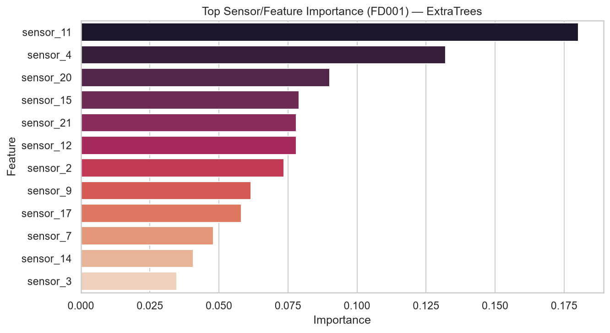

### FD002

| Feature | Importance |
| --- | --- |
| sensor_15 | 0.1469 |
| sensor_11 | 0.1466 |
| sensor_13 | 0.1254 |
| sensor_4 | 0.1046 |
| sensor_14 | 0.0697 |
| sensor_16 | 0.0432 |
| sensor_17 | 0.0393 |
| sensor_9 | 0.0348 |

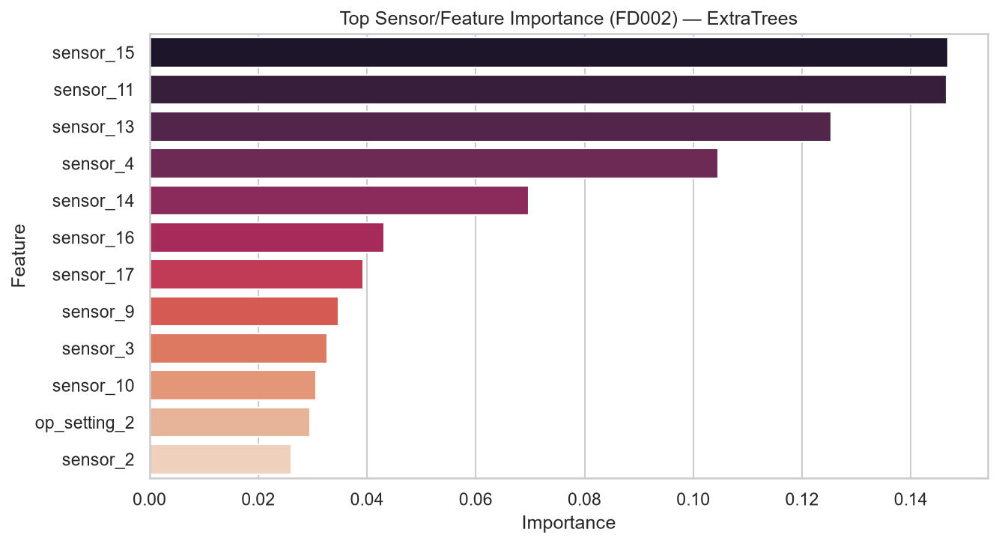

### FD003

| Feature | Importance |
| --- | --- |
| sensor_11 | 0.3072 |
| sensor_17 | 0.1268 |
| sensor_4 | 0.1173 |
| sensor_3 | 0.0906 |
| sensor_9 | 0.0535 |
| sensor_14 | 0.0473 |
| sensor_13 | 0.0455 |
| sensor_12 | 0.0432 |

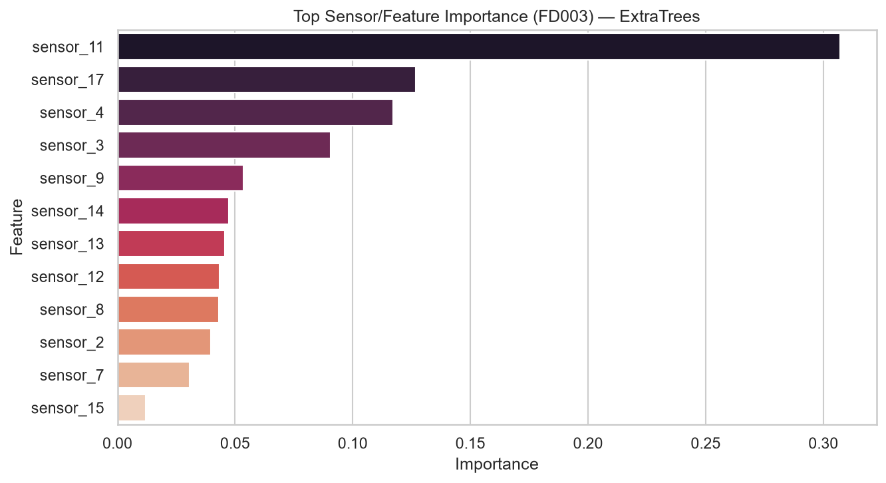

### FD004

| Feature | Importance |
| --- | --- |
| sensor_13 | 0.1835 |
| sensor_14 | 0.1302 |
| sensor_11 | 0.1269 |
| sensor_15 | 0.0836 |
| sensor_4 | 0.0753 |
| sensor_9 | 0.0403 |
| sensor_16 | 0.0376 |
| sensor_17 | 0.0353 |

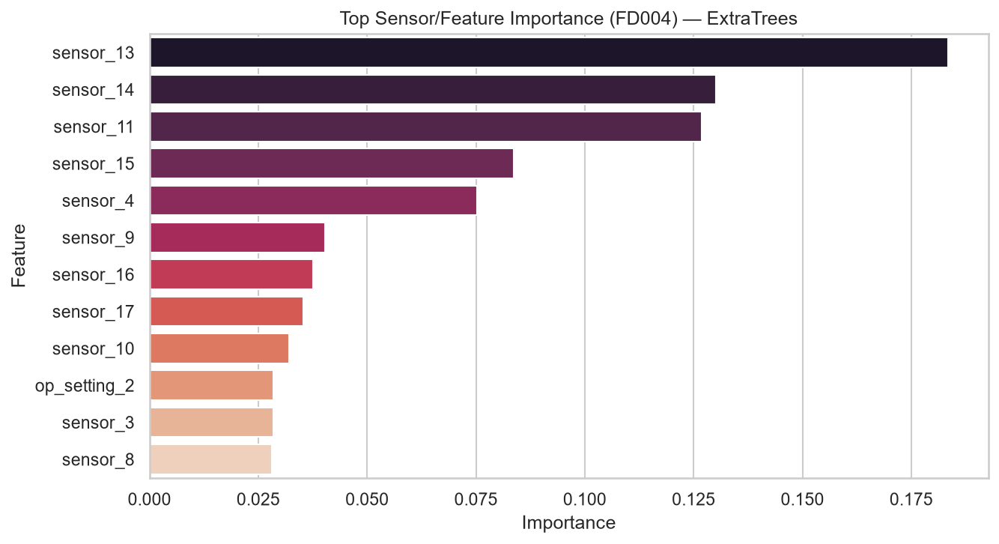

## Model Behavior

| Category | Models | Evidence |
|----------|--------|----------|

| Underfitting (early ML) | XGBoost, HistGBoost @10 | RMSE 28–43 at stage 10 |

| Stable (ML) | ExtraTrees, XGBoost @50–200 | RMSE change <1.5 from 50→200 |

| Overfitting (DL) | LSTM FD001 | Val loss exceeds train after epoch ~6 |

| Best balance | ExtraTrees, TemporalGAT, Transformer | Top RMSE, moderate gap |

## Figures

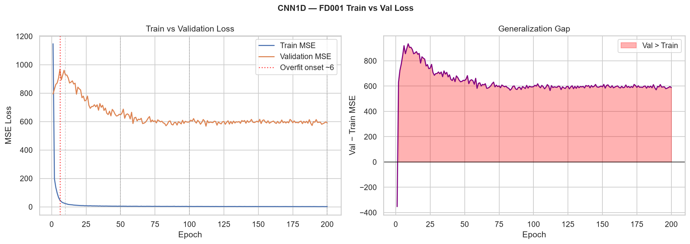

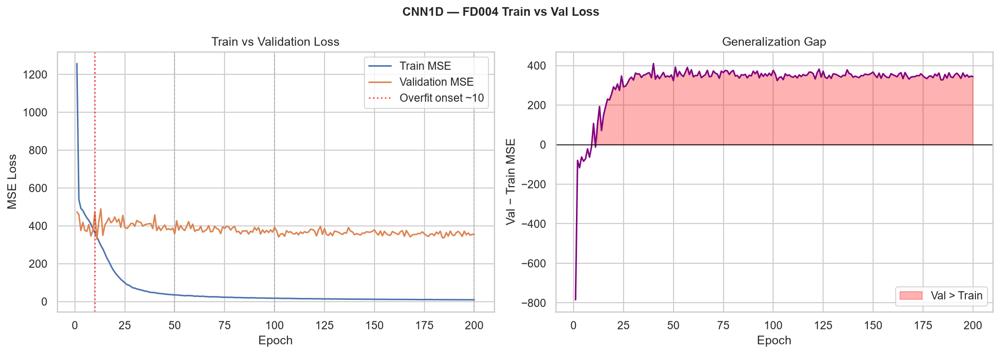

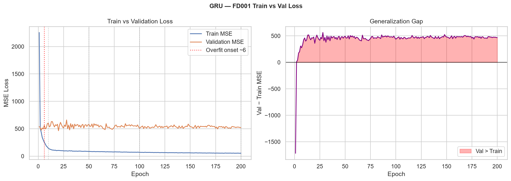

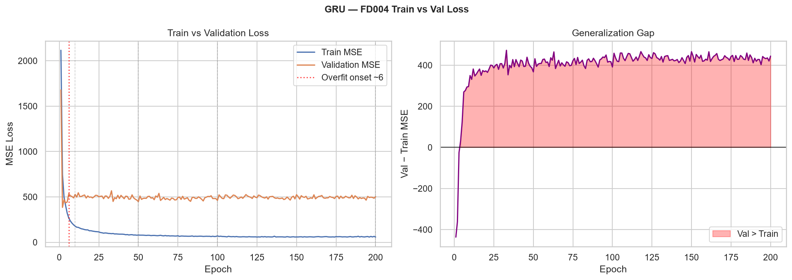

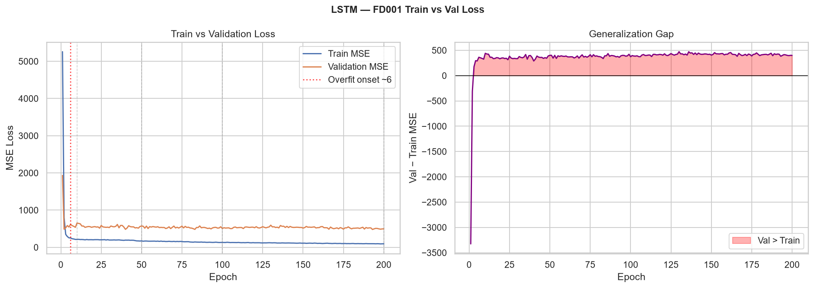

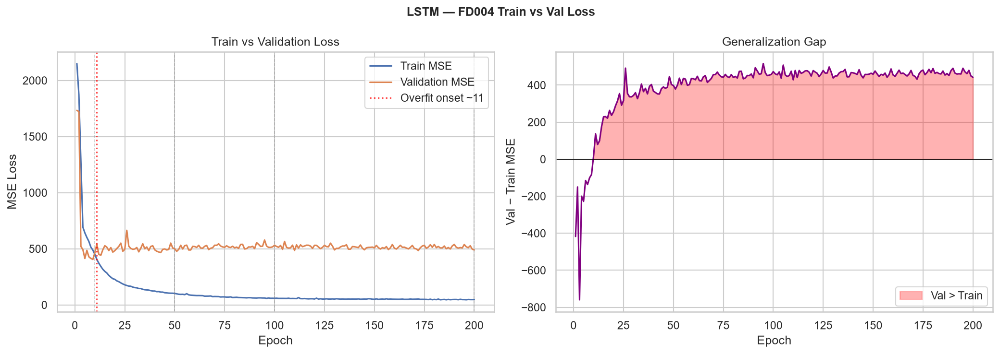

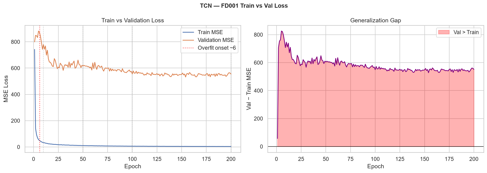

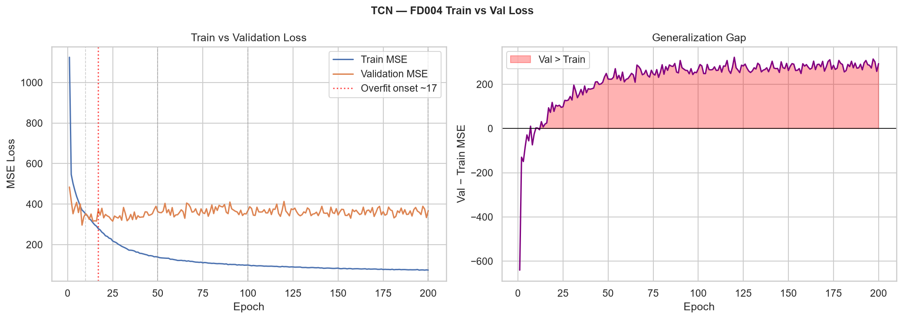

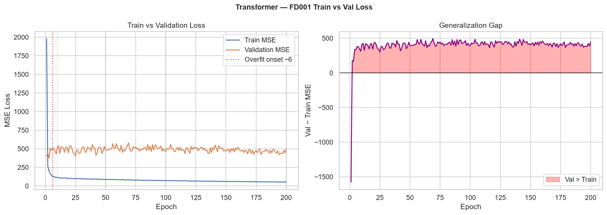

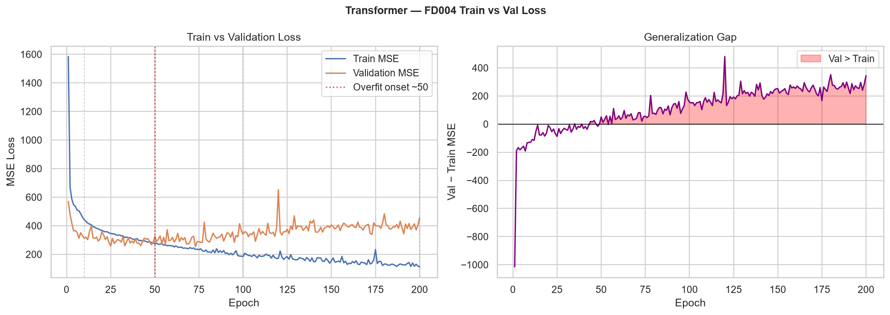

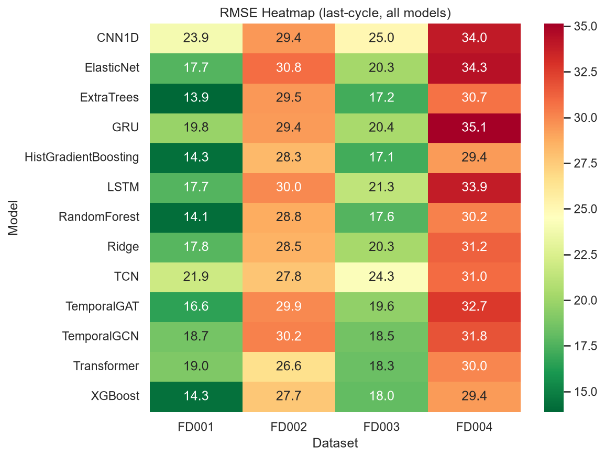

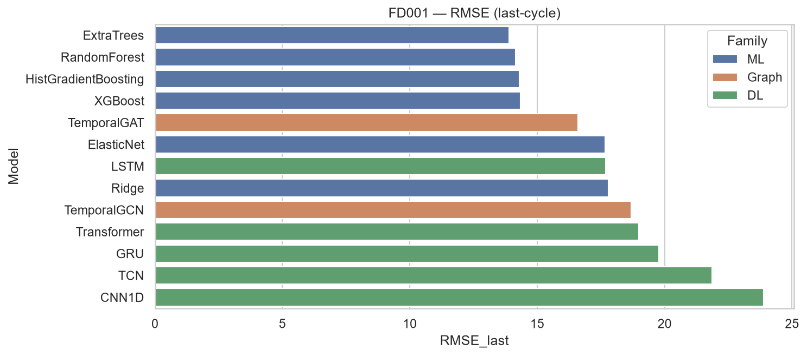

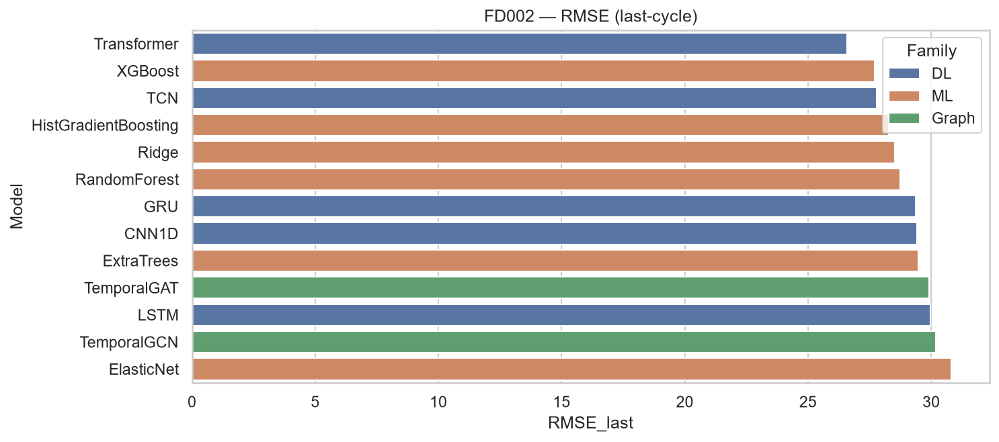

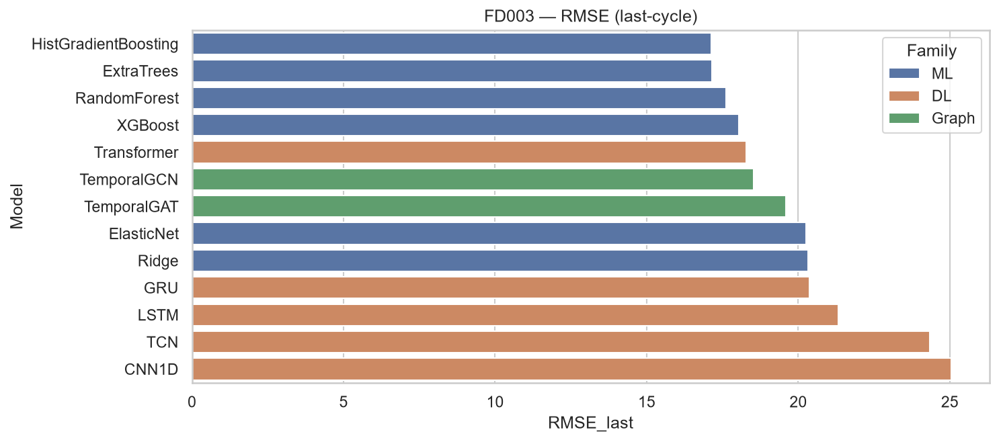

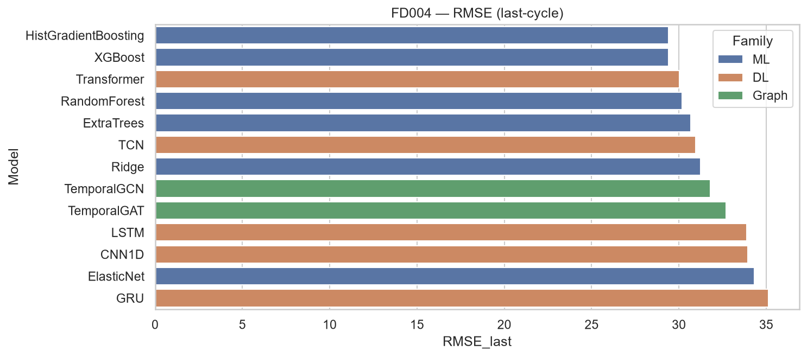

## Final Recommendation

- **FD001**: ExtraTrees (RMSE 13.89) or TemporalGAT (16.60) for graph-based approach.

- **FD002**: Transformer (RMSE 26.57) beats XGBoost (27.71).

- **FD003/FD004**: HistGradientBoosting (17.13 / 29.39).

- **Interpretability**: sensor_11, sensor_4, sensor_12 dominate FD001 importance.

## Saved Models

See `models/manifest.json` for best-model paths per dataset.

## File Index

| File | Description |
|------|-------------|

| `results/all_results_master.csv` | All models combined |

| `results/best_per_dataset_all.csv` | Best per dataset (all families) |

| `results/all_model_results.csv` | ML results |

| `results/dl_model_results.csv` | DL results |

| `results/graph_model_results.csv` | Graph results |

| `docs/epoch_metrics_ml.csv` | ML staged metrics |

| `docs/epoch_metrics_dl.csv` | DL epoch checkpoints |

| `models/*.pkl` | Saved ML models + DL metadata |

| `models/*.pth` | Saved DL model weights |
